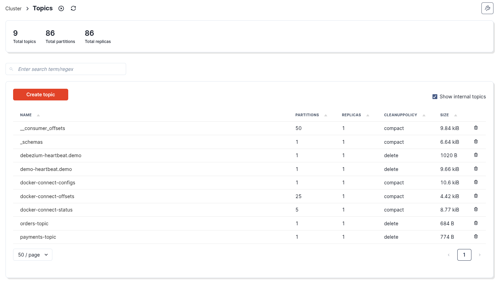
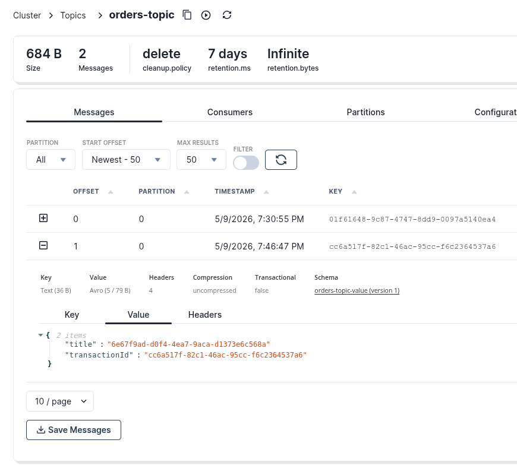
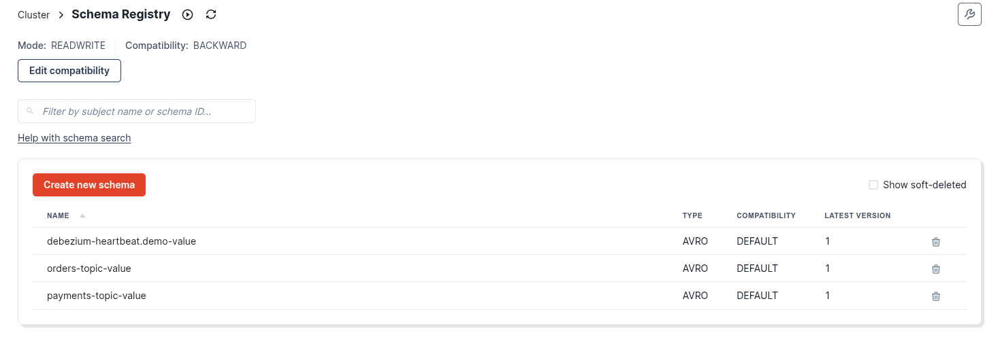
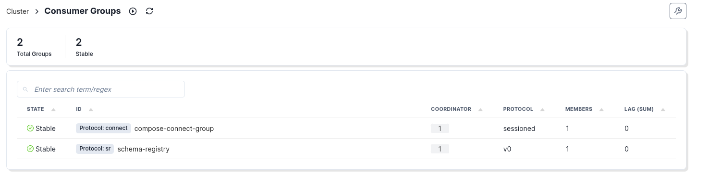
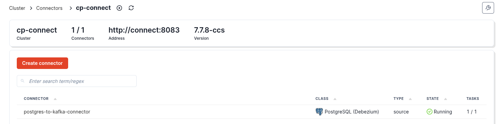

# Apache kafka + AsyncAPI + Avro schema + Kafka connect + Debezium postgresql source connector + Transactional outbox

**The project is designed as end-to-end kafka async api specification using transactional outbox pattern implementation with debezium**

## Requirements
- Java 21
- Docker
- Docker-compose
- Your local database should have logical replication enabled 'wal_level=logical'

Prepare your database:

```sql
ALTER SYSTEM SET wal_level = logical;
ALTER SYSTEM SET max_replication_slots = 10;
ALTER SYSTEM SET max_wal_senders = 10;
```

## Launch

```shell
  mvn clean package
```

```shell
docker compose -f ./docker/docker-compose.yml up -d
```

```shell
java -jar ./target/asyncapiavrooutbox-1.0-SNAPSHOT.jar
```

```shell
bash ./register-connector.sh
```
## Results

Topics orders and payments created and having data in avro format




Avro schema is also saved



Consumers are fine



Debezium postgresql connector is working and transporting new data



Notice:
The debezium heartbeat table is required to keep the connector active and manage the progression of the WAL. The heartbeat serves to:

- Prove that the connector is advancing: even in the absence of business events, we can distinguish a healthy connector from a blocked one.
- Prevent WAL accumulation: by generating regular traffic, the replication slot advances, which enables the cleanup of old segments.

⚠️ Without a heartbeat, an inactive system can unnecessarily accumulate WALs and saturate disk space.

⚠️ Also be careful with current logic in OutboxEventProducer: placement the create and delete queries inside the same transaction possibly can lead to events lose when connector is off or failed

## Docs and links

- AsyncAPI 3.0.0 spec https://www.asyncapi.com/docs/reference/specification/v3.0.0
- Debezium outbox event router description https://debezium.io/documentation/reference/3.4/transformations/outbox-event-router.html
- Debezium connector https://debezium.io/documentation/reference/1.9/connectors/postgresql.html
- Original article https://medium.com/adeo-tech/outbox-pattern-debezium-strict-avro-4a32c98155c0
- Avro spec https://avro.apache.org/docs/1.12.0/specification/


